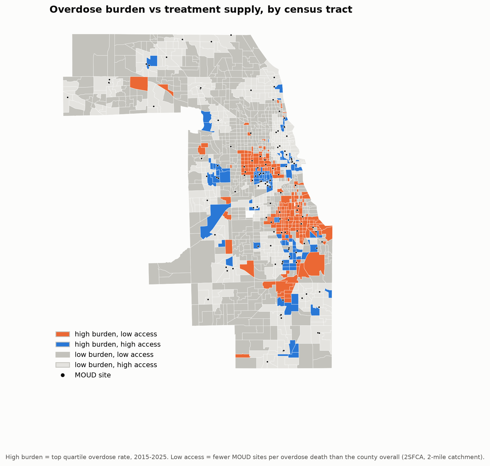
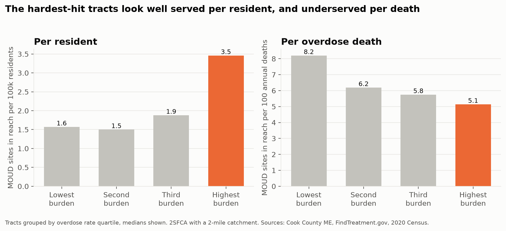

# Cook County Treatment Deserts

Where are overdose deaths happening in Cook County, is addiction treatment located where people are dying, and who lives in the places where it isn't? This project maps 17,000 overdose deaths from the Medical Examiner against every site offering medications for opioid use disorder (MOUD), and measures access *relative to need* instead of just distance.



## Key Findings

- **Distance to treatment was the wrong measure.** The tracts with the highest overdose death rates are the *closest* to a clinic (median 0.6 miles), because clinics open where need is. Measured per resident, those tracts look the best served in the county. Measured per overdose death, they have the least treatment supply.
- **227 census tracts hold 12.4% of residents and 39.3% of overdose deaths** while having fewer MOUD sites per death than the county overall. They have 4.2 sites per 100 annual deaths, compared with 9.8 in other high-burden tracts.
- **Those tracts are poorer and more car-free.** Compared with better-served high-burden tracts: median household income of $43,951 vs $58,189, 26% vs 19% in poverty, 30% vs 21% of households without a vehicle. The median tract is 80% Black.
- **Car-free households have the strongest link to overdose rates.** In a negative binomial model, each 10 more points of households without a vehicle goes with a 20% higher overdose death rate (95% CI 12% to 29%), holding poverty, insurance, and racial composition fixed.
- **The fentanyl era, then a decline.** Deaths tripled from 629 in 2015 to 2,060 in 2022, with fentanyl in 84% of them at the peak, then fell 56% by 2025. The median age at death rose from 45 to 53.



## Tech Stack
- **Python:** pandas, numpy, geopandas, shapely, statsmodels, matplotlib
- **APIs and data:** Cook County Medical Examiner Case Archive (Socrata API), SAMHSA FindTreatment.gov, U.S. Census ACS 5-year estimates (Census API), Census TIGER/Line boundaries, Census batch geocoder
- **Methods:** two-step floating catchment area (2SFCA) spatial access, negative binomial regression with a population offset, Moran's I, cluster-robust standard errors
- **Tableau** for the dashboard (in progress)

## How to Run

1. Clone the repo and set up a virtual environment:
   ```bash
   python -m venv .venv
   .venv\Scripts\activate
   pip install -r requirements.txt
   ```
2. Get a free Census API key at https://api.census.gov/data/key_signup.html, then copy `.env.example` to `.env` and paste the key in.
3. Run the pipeline from the project root. It pulls every data source fresh and takes about five minutes:
   ```bash
   python -m src.run_pipeline
   ```
4. Open the notebooks in `notebooks/` in order. Each one saves its figures to `outputs/figures/`.

Any single step can be rerun on its own, for example `python -m src.build_tract_table`, without calling the APIs again.

## Project Structure
```
src/
  config.py             every threshold and definition, in one place
  fetch_overdoses.py    ME API pull (all accidental deaths)
  clean_overdoses.py    overdose classification from cause-of-death text
  fetch_census.py       tracts, block populations, ACS demographics
  assign_tracts.py      spatial join, with a geocoding fallback
  geocoding.py          Census batch geocoder wrapper
  fetch_treatment.py    FindTreatment.gov pull, MOUD classification, dedupe
  access.py             2SFCA access scores
  build_tract_table.py  the main tract-level analysis table
  model.py              count model, Moran's I, rate ratio table
  export_tableau.py     suppressed extracts for the dashboard
  plots.py              shared chart styling
notebooks/
  02_where_and_when     trends, concentration, timing
  03_access             distance vs need-based access, who lives in underserved tracts
  04_model              negative binomial model of structural conditions
docs/methodology.md     every judgment call, with the reasoning and what changed
outputs/figures/        charts used here and in the brief
outputs/tableau/        suppressed extracts that feed the dashboard
```

## Key Features

- **An overdose definition that holds up to scrutiny.** The Medical Examiner's own "opioids" flag turned out to mark involvement, not cause (it's set on asthma and drowning deaths). Deaths are classified from the cause-of-death text instead, including a dozen real misspellings of "fentanyl" found in the data.
- **Access measured against need.** When distance to the nearest clinic pointed the wrong way, the analysis switched to a need-based 2SFCA, a standard health-access method, and checked that the result holds at 1, 2, and 3 mile catchments.
- **Models checked, not just fit.** Poisson was tested for overdispersion (the variance was nearly 7 times what Poisson assumes), residuals were tested for spatial clustering (Moran's I = 0.30), and the final model uses standard errors clustered by area.
- **Privacy guardrails.** Any tract count under 10 is suppressed before it reaches a chart or the dashboard, and findings are framed around access and structural conditions rather than group behavior.
- **A documented decision log.** [docs/methodology.md](docs/methodology.md) records every definition and threshold, why it was chosen, and the cases where an early choice was wrong and got changed.

## Limitations
- The ME archive only covers deaths under its jurisdiction, and 5.5% of overdose deaths couldn't be placed in a tract.
- Deaths are mapped where they happened, not where the person lived.
- FindTreatment.gov doesn't publish capacity, so a large methadone clinic and a small practice count the same. It also doesn't list individual buprenorphine prescribers, so primary care access isn't captured.
- The model is cross-sectional and ecological: it describes tract-level patterns, not individual risk or causes.
- Catchments are straight-line distance. Transit travel time is the planned next step.

## What I Learned
*(Draft, to be rewritten in my own words.)* The biggest lesson was that the first result can reject the question. Distance to treatment ran backwards, and working out why (clinics open where need is) led to a better measure and a stronger finding. I also learned to check a model's assumptions before trusting it: overdispersion ruled out Poisson, and spatially clustered residuals meant the default confidence intervals were too narrow.
